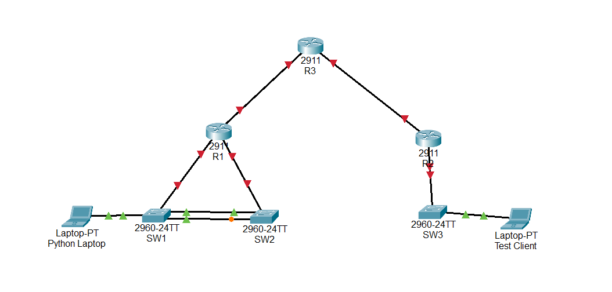

# Network Discovery

---

<aside>
📜 **TABLE OF CONTENTS**

</aside>

# **Introduction**

This script is a step up from the others because it doesn't need a list of IP addresses to start. I wanted to see if I could make a script that "finds its own way" through the network. It starts with just one "seed" IP, logs in, and looks at the **CDP neighbors** to see who else is connected. The biggest challenge here was that the CDP table usually shows the Vlan1 IP, but my management network is on the `.99` subnet.  I had to go into the switches to disable Vlan 1 since I wasn’t using it and refresh CDP so that the table would update with the correct addresses. However, for the routers I wasn’t able to change the CDP addresses so I had to write some logic to catch those IPs and swap them to the right subnet so the script could keep moving.

## Network Topology



### Technical Stack

- **Hardware:** 3x Cisco 2921 Routers, 3x Cisco Catalyst 2960 Switches.
- **Automation:** Python 3.13.11, Netmiko (SSH-based management), Cisco Genie (pyATS).
- **Concurrency:** Python `concurrent.futures` (ThreadPoolExecutor)

### Key Features

- **Recursive Discovery:** The script keeps running as long as it finds "new" neighbors it hasn't talked to yet.
- **IP Translation:** Automatically detects `192.168.1.x` addresses in the CDP table and converts them to `192.168.99.x` so the SSH connection actually works.
- **Loop Prevention:** I used a `searched_network_list` to act as a "memory" so the script doesn't get stuck in a loop going back and forth between the same two switches.

## Automation Script

Network Discovery Crawler

This script uses a "Queue" system. It pulls an IP from the list, searches it, finds new neighbors, and adds those new neighbors back into the list to be searched in the next batch

```python
import json
from netmiko import ConnectHandler
from concurrent.futures import ThreadPoolExecutor

# def add_to_list(network_list, ip):

    
#     if ip not in network_list:
#         network_list.append(ip)
    
    

def connect_to_device(ip,network_list, searched_network_list):

    device_params = {
        'device_type': 'cisco_ios',
        'host': ip,
        'username': 'admin',
        'password': 'Cisco123',
    }

    if ip in searched_network_list:
        return

    try:
        with ConnectHandler(**device_params) as conn:
            print(f"Successfully connected to {ip}")

            cdp_output = conn.send_command("show cdp neighbors detail", use_genie=True)
            cdp_json = f"cdp_information__{device_params['host']}.json"
            with open(cdp_json, 'w') as f:
                json.dump(cdp_output, f, indent=4)
            index = cdp_output.get("index",{})
            # print(index)
            for device , data in index.items():
                #dict(device)
                # print(f"{device} \n\n")
                # print(data)

                device_id = data.get("device_id")
                # print(device_id)
                management_data = data.get("management_addresses")
                if not management_data:
                    management_data = data.get("entry_addresses")
                    
                for mngmnt_ip in management_data.keys():
                    # print(mngmnt_ip)
                    if mngmnt_ip.startswith("192.168.1"):
                        new_ip = mngmnt_ip.replace(".1.",".99.")
                        mngmnt_ip = new_ip
                    # print(mngmnt_ip)
                    if mngmnt_ip not in searched_network_list and mngmnt_ip not in network_list:
                        network_list.append(mngmnt_ip)

                
            searched_network_list.append(ip)
            
    except Exception as e:
        print(f"Failed to connect to {ip}: {e}")
        searched_network_list.append(ip)

def main():
    network_list =['192.168.99.11']
    searched_network_list = []
    while network_list:
        current_batch = network_list[:]
        network_list.clear()

        with ThreadPoolExecutor(max_workers=10) as executor:
            executor.map(lambda ip: connect_to_device(ip, network_list, searched_network_list), current_batch)
        network_list = [ip for ip in network_list if ip not in searched_network_list]
        print(f"Completed Batch. Next to seatch: {network_list}")
 

if __name__ == "__main__":
    main()
```

## Lessons Learned & Technical Challenges

### 1. The Vlan1 IP Mismatch

**Challenge:** Initially, my script would find a neighbor but fail to connect. I realized CDP was reporting the neighbor's Vlan1 IP, which I didn't have SSH access to.
**Solution:**  I had to go into the switches to disable Vlan 1 since I wasn’t using it and refresh CDP so that the table would update with the correct addresses. However, for the routers I wasnt able to fix it the same way so I used the `.replace()` method to dynamically change the IP address string from the `.1.` subnet to the `.99.` subnet before the script tried to connect to the next device.

### 2. Modifying Lists while Looping

**Challenge:** In my first version, I tried to add new IPs to the same list I was currently looping through. Python doesn't like this and it caused the script to skip switches or stop early.
**Solution:** I refactored the `main()` function to use a "batch" system. It takes a snapshot of the current list (`current_batch`), clears the main list, and then fills the main list back up with only the *newly* discovered neighbors.

### 3. Handling "Empty" CDP Data

**Challenge:** For the routers the `management_addresses` in the Genie output would be empty, which crashed the script.
**Solution:** I added a simple `if not management_data:` check. If the management field is empty, the script looks at `entry_addresses` instead. This made the crawler much more "sturdy" when hitting different types of Cisco gear.

---