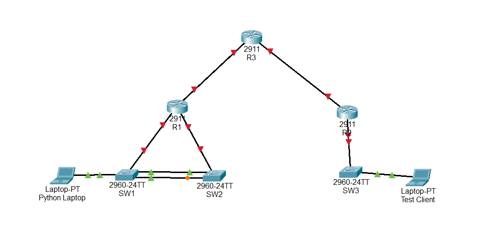

# Multi-Site Network Automation Project

---

<aside>
📜 **TABLE OF CONTENTS**

</aside>

# **Introduction**

This project simulates a multi-site network environment consisting of two branch offices connected to a simulated ISP core. The goal of this lab was to move away from manual CLI configuration and utilize Python

automation to deploy Layer 2 and Layer 3 configurations across Cisco physical hardware

## Network Topology



### Technical Stack

- **Hardware:** 3x Cisco 2921 Routers, 3x Cisco Catalyst 2960 Switches.
- **Automation:** Python 3.13.11, Netmiko (SSH-based management).
- **Infrastructure:** VLANs (Sales, HR, IT, Management), VTP, DHCP, OSPF, NAT/PAT.

### Physical Connections:

- R1 (g0/0) ↔ R3 (g0/0)
- R2 (g0/0) ↔ R3 (g0/1)
- R1 (g0/1) ↔ SW1(g0/1)
- R1 (g0/2) ↔ SW2(g0/1)
- R2 (g0/1) ↔ SW3(g0/1)
- SW1(fa0/13-14) ↔ SW2(fa0/13-14)
- SW1(fa0/1) ↔ Python Laptop
- SW3(fa0/1) ↔ Test Client Laptop

### Key Topology Features

- **Core Routing:** OSPF Area 0 for internal reachability
- **Branch Architecture:** Router-on-a-Stick (RoAS) for  Inter-VLAN routing
- **Redundancy:** LACP EtherChannel and Rapid-PVST+ for loop prevention and high availability
- **Security & Edge:** NAT/PAT Overload for internet access and Management VLANs for secure SSH access.

### IP Schema

| Device | Management IP | OSPF ID |
| --- | --- | --- |
| R1 | 192.168.99.1 | 1.1.1.1 |
| R2 | 192.168.199.1 | 2.2.2.2 |
| SW1 | 192.168.99.11 | N/A |
| SW2 | 192.168.99.12 | N/A |
| SW3 | 192.168.199.11 | N/A |

## Automation Scripts

1. VLAN & Trunking (VTP/LACP)

This script initializes the VTP domains and configures LACP between switch stacks

```python
from netmiko import ConnectHandler

device_config = {
    '192.168.99.11': [
        'vtp mode server',
        'vtp domain CCNA',
        'vlan 10',
        'name SALES',
        'vlan 20',
        'name HR',
        'vlan 30',
        'name IT',
        'vlan 99',
        'name MANAGEMENT',
        'int range fa0/13-14',
        'channel-protocol lacp',
        'channel-group 1 mode active',
        'int port-channel 1',
        'switchport mode trunk',
        'switchport trunk allowed vlan 10,20,30,99',
    ],
    '192.168.99.12': [
        'vtp mode client',
        'vtp domain CCNA',
        'int range fa0/13-14',
        'channel-protocol lacp',
        'channel-group 1 mode passive',
        'int port-channel 1',
        'switchport mode trunk',
        'switchport trunk allowed vlan 10,20,30,99',
    ],
    '192.168.199.11': [
        'vtp mode server',
        'vtp domain CCNA',
        'vlan 10',
        'name SALES',
        'vlan 20',
        'name HR',
        'vlan 30',
        'name IT',
        'vlan 99',
        'name MANAGEMENT',
    ]
}

for ip, commands in device_config.items():
    print(f"Connecting to device: {ip}")
    device_params = {
        'device_type': 'cisco_ios',
        'host': ip,
        'username': 'admin',
        'password': 'Cisco123',
    }

    try:
        with ConnectHandler(**device_params) as conn:
		       output = conn.send_config_set(commands)
           print(output)
           print("--- VTP Status ---")
           vtp_status = conn.send_command('show vtp status')
           print(vtp_status)
           print("--- VLANS ---")
           vlans = conn.send_command('show vlan')
           print(vlans)

    except Exception as e:
        print("Error connecting to {ip}: {e}")
```

1. Router-on-a-Stick & DHCP Deployment

Automates the creation of sub-interfaces for inter-VLAN routing and defines DHCP pools for automated client addressing

```python
from netmiko import ConnectHandler

device_config = {
    '192.168.99.1': [   
        'int g0/1.10',
        'encapsulation dot1q 10',
        'ip add 192.168.10.1 255.255.255.0',
        'int g0/1.20',
        'encapsulation dot1q 20',
        'ip add 192.168.20.1 255.255.255.0',
        'int g0/1.30',
        'encapsulation dot1q 30',
        'ip add 192.168.30.1 255.255.255.0',
        'int g0/1.99',
        'encapsulation dot1q 99',
        'ip add 192.168.99.1 255.255.255.0',
        'int g0/2.10',
        'encapsulation dot1q 10',
        'ip add 192.168.10.2 255.255.255.0',
        'int g0/2.20',
        'encapsulation dot1q 20',
        'ip add 192.168.20.2 255.255.255.0',
        'int g0/2.30',
        'encapsulation dot1q 30',
        'ip add 192.168.30.2 255.255.255.0',
        'int g0/2.99',
        'encapsulation dot1q 99',
        'ip add 192.168.99.2 255.255.255.0',
        'ip dhcp excluded-address 192.168.10.1 192.168.10.20',
        'ip dhcp excluded-address 192.168.20.1 192.168.20.20',
        'ip dhcp excluded-address 192.168.30.1 192.168.30.20',
        'ip dhcp excluded-address 192.168.99.1 192.168.99.20',
        'ip dhcp pool VLAN10',
        'network 192.168.10.0 255.255.255.0',
        'default-router 192.168.10.1',
        'ip dhcp pool VLAN20',
        'network 192.168.20.0 255.255.255.0',
        'default-router 192.168.20.1',
        'ip dhcp pool VLAN30',
        'network 192.168.30.0 255.255.255.0',
        'default-router 192.168.30.1',
        'ip dhcp pool VLAN99',
        'network 192.168.99.0 255.255.255.0',
        'default-router 192.168.99.1',
        'router ospf 1',
        'network 192.168.99.0 0.0.0.255 area 0',
    ],
    '192.168.199.1': [
        'int g0/1.10',
        'encapsulation dot1q 10',
        'ip add 192.168.10.1 255.255.255.0',
        'int g0/1.20',
        'encapsulation dot1q 20',
        'ip add 192.168.20.1 255.255.255.0',
        'int g0/1.30',
        'encapsulation dot1q 30',
        'ip add 192.168.30.1 255.255.255.0',
        'int g0/1.99',
        'encapsulation dot1q 99',
        'ip add 192.168.199.1 255.255.255.0',
        'ip dhcp excluded-address 192.168.10.1 192.168.10.20',
        'ip dhcp excluded-address 192.168.20.1 192.168.20.20',
        'ip dhcp excluded-address 192.168.30.1 192.168.30.20',
        'ip dhcp excluded-address 192.168.199.1 192.168.199.20',
        'ip dhcp pool VLAN10',
        'network 192.168.10.0 255.255.255.0',
        'default-router 192.168.10.1',
        'ip dhcp pool VLAN20',
        'network 192.168.20.0 255.255.255.0',
        'default-router 192.168.20.1',
        'ip dhcp pool VLAN30',
        'network 192.168.30.0 255.255.255.0',
        'default-router 192.168.30.1',
        'ip dhcp pool VLAN99',
        'network 192.168.199.0 255.255.255.0',
        'default-router 192.168.199.1',
        'router ospf 1',
        'network 192.168.199.0 0.0.0.255 area 0',
    ]
}

for ip, commands in device_config.items():
    print(f"Connecting to device: {ip}")
    device_params = {
        'device_type': 'cisco_ios',
        'host': ip,
        'username': 'admin',
        'password': 'Cisco123',
    }

    try:
        with ConnectHandler(**device_params) as conn:
           output = conn.send_config_set(commands)
           print(output)

    except Exception as e:
        print("Error connecting to {ip}: {e}")
```

1. Switch port Configuration

This script automates the configuration of access and trunk ports 

```python
from netmiko import ConnectHandler

device_config = {
    '192.168.99.11': [
        'int fa0/1',
        'switchport mode access',
        'switchport access vlan 10',
        'int g0/1',
        'switchport mode trunk',
        'switchport trunk allowed vlan 10,20,30,99',
    ],
    '192.168.99.12': [
        'int fa0/1',
        'switchport mode access',
        'switchport access vlan 20',
        'int g0/1',
        'switchport mode trunk',
        'switchport trunk allowed vlan 10,20,30,99',
    ],
    '192.168.199.11': [
        'int fa0/1',
        'switchport mode access',
        'switchport access vlan 30',
        'int g0/1',
        'switchport mode trunk',
        'switchport trunk allowed vlan 10,20,30,99',
    ]
}

for ip, commands in device_config.items():
    print(f"Connecting to device: {ip}")
    device_params = {
        'device_type': 'cisco_ios',
        'host': ip,
        'username': 'admin',
        'password': 'Cisco123',
    }

    try:
        with ConnectHandler(**device_params) as conn:
           output = conn.send_config_set(commands)
           print(output)

    except Exception as e:
        print("Error connecting to {ip}: {e}")
```

1. STP configuration

This script configures rapid-pvst+ on all of the switches

```python
from netmiko import ConnectHandler

device_config = {
    '192.168.99.11': [
        'spanning-tree mode rapid-pvst',
    ],
    '192.168.99.12': [
        'spanning-tree mode rapid-pvst',
    ],
    '192.168.199.11': [
        'spanning-tree mode rapid-pvst',
    ]
}

for ip, commands in device_config.items():
    print(f"Connecting to device: {ip}")
    device_params = {
        'device_type': 'cisco_ios',
        'host': ip,
        'username': 'admin',
        'password': 'Cisco123',
    }

    try:
        with ConnectHandler(**device_params) as conn:
           output = conn.send_config_set(commands)
           print(output)
           print("--- STP Status ---")
           stp_status = conn.send_command('show spanning-tree')
           print(stp_status)

    except Exception as e:
        print("Error connecting to {ip}: {e}")
```

1. NAT Configuration

Configures Access Control Lists to define which traffic should be translated and applies NAT Overload to the edge interfaces

```python
from netmiko import ConnectHandler

device_config = {
# Change the third octet to 99 (OFFICE A) or 199 (OFFICE B) depending on which office you are in.
    '192.168.199.1': [
        'int g0/0',
        'ip nat outside',
        'int range g0/1.10',
        'ip nat inside',
        'int range g0/1.20',
        'ip nat inside',
        'int range g0/1.30',
        'ip nat inside',
        'int range g0/1.99',
        'ip nat inside',
        'int range g0/2.10',
        'ip nat inside',
        'int range g0/2.20',
        'ip nat inside',
        'int range g0/2.30',
        'ip nat inside',
        'int range g0/2.99',
        'ip nat inside',
        'access-list 10 deny 192.168.99.0 0.0.0.255',
        'access-list 10 deny 192.168.199.0 0.0.0.255',
        'access-list 10 permit 192.168.10.0 0.0.0.255',
        'access-list 10 permit 192.168.20.0 0.0.0.255',
        'access-list 10 permit 192.168.30.0 0.0.0.255',
        'ip nat inside source list 10 int g0/0 overload',
    ]
}

for ip, commands in device_config.items():
    print(f"Connecting to device: {ip}")
    device_params = {
        'device_type': 'cisco_ios',
        'host': ip,
        'username': 'admin',
        'password': 'Cisco123',
    }

    try:
        with ConnectHandler(**device_params) as conn:
           output = conn.send_config_set(commands)
           print(output)

    except Exception as e:
        print("Error connecting to {ip}: {e}")
```

## Lessons Learned & Technical Challenges

### 1. The SSH Management Lockout

**Challenge:** During the switch configuration rollout, the script converted the active management port into an access port for a different VLAN. This immediately dropped the SSH session and prevented the script from completing.
**Solution:** I had to manually recover via console and re-establish the SVI on VLAN 99.
**Lesson:** Future Scripts will include logic to verify management path persistence, and I need to plan out the order of execution better.

### 2. VTP & Trunking Dependency

**Challenge:** VTP updates were failing to propagate to downstream switches.
**Solution:** Remembered that VTP advertisements only travel over trunk links. I updated the script to ensure `switchport mode trunk` was established prior to VTP domain configuration.

### 3. NAT on Logical Sub-Interfaces

**Challenge:** NAT was configured on the physical parent interface (g0/1), but traffic from internal VLANs was not being translated.
**Solution:** Learned that in a Router-on-a-Stick (RoAS) environment, the `ip nat inside` command must be applied to every **sub-interface**, not just the physical port. Once applied to `.10`, `.20`, etc., translation was successful.

---
